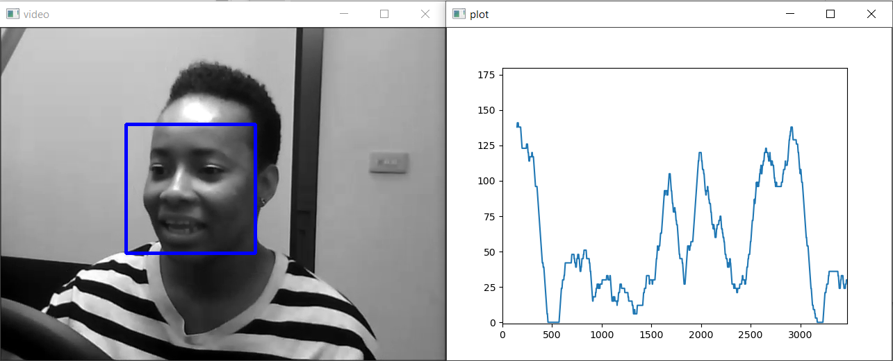
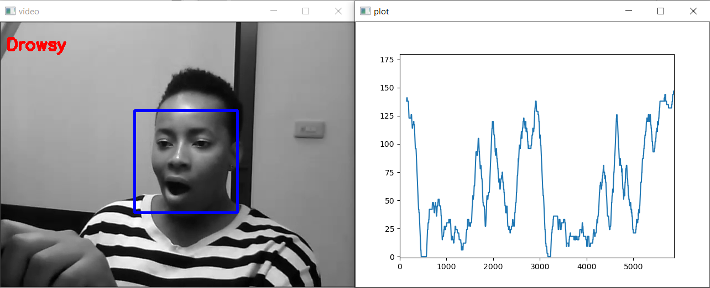

# Driver-Drowsiness-Detection

### ABOUT

This project represents my bachelor's degree and aims to develop a method of identifying the falling asleep event, using knowledge of artificial intelligence. To create this system, 3 methods were approached to be analyzed:

  * Classification based on the results obtained from the application of Eye Aspect Ratio, Mouth Aspect Ratio, Pupil Circularity, Mouth Aspect Ratio over Eye Aspect Ratio - 60.82% accuracy
  * Classification based on facial landmarks - 71.19% accuracy
  * Classification using convolutional neural network VGG16 - overfitting
 
 The project presents a variety of used algorithms. These are used to perform facial detection, locate the 68 points characteristic of facial landmarks and calculate Eye Aspect Ratio, Mouth Aspect Ratio, Pupil Circularity, Mouth Aspect Ratio over Eye Aspect Ratio. Furthermore, it is presented how convolutional neural network VGG16 is constructed.
 
 ### SET UP
 For this project, I use an environment already created by Jeff Heaton. To save the environment, you just to floow next steps:
  1. Install MiniConda
  2. Download environment setup script: https://raw.githubusercontent.com/jeffheaton/t81_558_deep_learning/master/tensorflow.yml
  3. Open Command Prompt and write next lines:
  
```
$ ren tensorflow.yml.txt tensorflow.yml
$ conda env create -v -f tensorflow.yml
```
    
  4. Open MiniConda and write next lines:
  
```
$ conda activate tensorflow
$ pip install opencv-python
$ conda install -c conda-forge dlib
$ pip install keras
$ conda deactivate
```

  5. Add this invorenment in your python interpreter
  
### Database
The database I used in the analysis of creating this project is: Driver Drowsiness Detection Dataset (http://cv.cs.nthu.edu.tw/php/callforpaper/datasets/DDD/)
  
### System functionality analysis
To see how the trained classifier works, I created a function that helps me notice this. This function visually shows the level of sleep for a person who drives a vehicle. Also, it shows a message when the sleep event lasts too long.

The input for this function is a video and the model chosen for the classification of alert-sleepy events. The steps that are performed within the function are:

  * apply the facial detector for each frame - When the facial detector identifies several faces, it choose the one closest to the camera because in a car it is possible to have other passengers who may appear in the camera lens
  * apply the binary classifier that is configured based on the train data 
      * if it is used classification based on facial landmarks, you have to first identify the landmarks for eyes and mounth and after that to apply the classifier
      * if it is used classification based on the results obtained from the application of Eye Aspect Ratio, Mouth Aspect Ratio, Pupil Circularity, Mouth Aspect Ratio over Eye Aspect Ratio, you have to first calculate those 4 features and after that to apply the classifier
  * add the predicted value within an amount that represents the sum of the predictions for the chosen frames for a duration of 5 seconds
  * if amount is represented by more than 70% of predictions corresponding to the drowsiness event, it will show an appropriate message.



  
